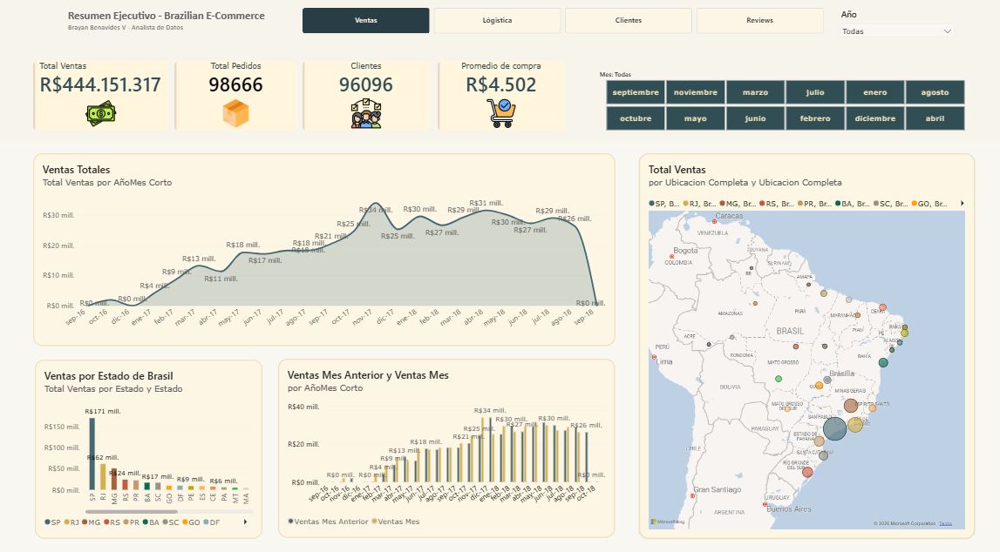
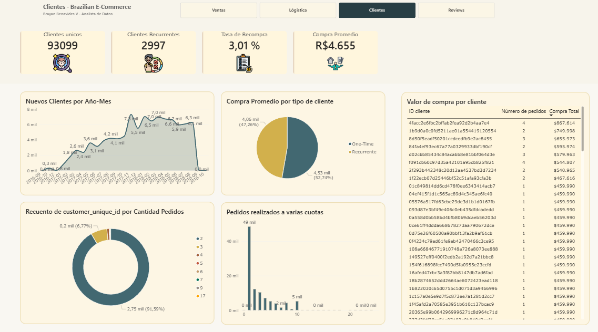
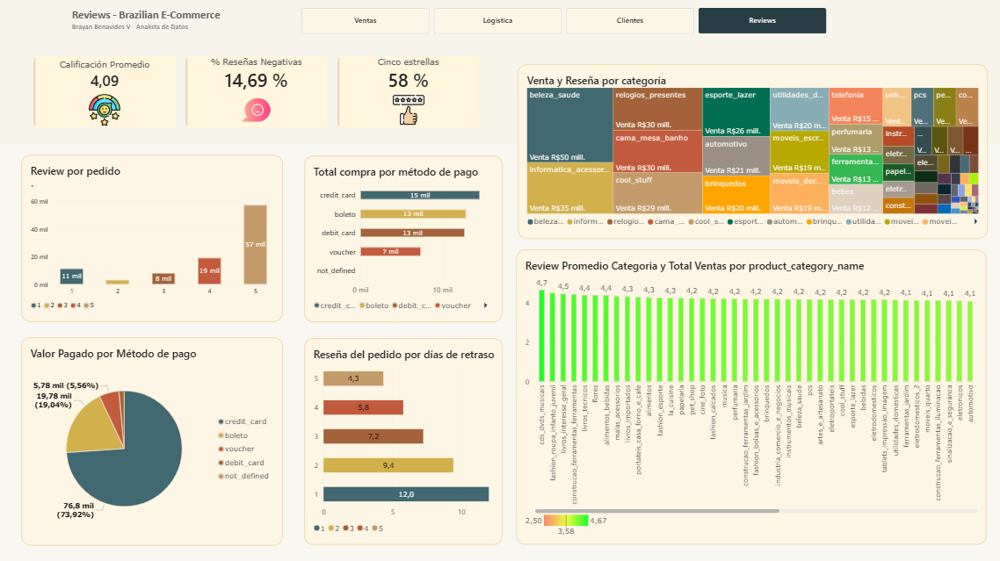

<<<<<<< Updated upstream
# brazilian-ecommerce-analytics
# Brazilian E-Commerce Analysis — Olist Dataset
**Herramientas:** Power BI · DAX · Power Query
**Dataset:** Olist E-Commerce (Kaggle) — 100K pedidos, 2016–2018
=======
\# Brazilian E-Commerce Analysis — Olist Dataset

\*\*Herramientas:\*\* Power BI · DAX · Power Query

\*\*Dataset:\*\* Olist E-Commerce (Kaggle) — 100K pedidos, 2016–2018

\## Objetivo

Analizar el comportamiento de ventas, logística y satisfacción

del cliente de Olist, el mayor marketplace de Brasil, para

identificar oportunidades de mejora operativa.

\## Hallazgos clave

\- 📦 El 7,87% de los pedidos llega con retraso —

&#x20; con impacto directo en satisfacción (4,21 → 1,68 de reseña)

\- 🗺️ SP concentra el 38,5% de las ventas totales;

&#x20; los estados del norte tienen retrasos de hasta 48 días

\- 🔄 Tasa de recompra del 3,01% — señal de oportunidad

&#x20; crítica en retención

\- 💳 73,9% de pagos en tarjeta de crédito;

&#x20; ticket promedio R$4.655

\## Dashboard

!\[Dashboard Ventas](images/Ventas.png)

!\[Dashboard Logística](images/Logistica.png)

!\[Dashboard Clientes](images/Clientes.png)

!\[Dashboard Reviews](images/Reviews.png)

\## Estructura del análisis

\- \*\*Ventas:\*\* tendencia temporal, top categorías,

&#x20; distribución geográfica

\- \*\*Logística:\*\* retrasos por estado/ciudad,

&#x20; impacto en satisfacción

\- \*\*Clientes:\*\* segmentación, LTV, tasa de recompra

\- \*\*Reviews:\*\* calificación por categoría,

&#x20; correlación con retrasos

\## Dataset

Fuente: \[Olist E-Commerce Dataset — Kaggle](https://www.kaggle.com/datasets/olistbr/brazilian-ecommerce)
>>>>>>> Stashed changes

## Objetivo
Analizar el comportamiento de ventas, logística y satisfacción
del cliente de Olist, el mayor marketplace de Brasil, para
identificar oportunidades de mejora operativa.

## Hallazgos clave
- 📦 El 7,87% de los pedidos llega con retraso —
  con impacto directo en satisfacción (4,21 → 1,68 de reseña)
- 🗺️ SP concentra el 38,5% de las ventas totales;
  los estados del norte tienen retrasos de hasta 48 días
- 🔄 Tasa de recompra del 3,01% — señal de oportunidad
  crítica en retención
- 💳 73,9% de pagos en tarjeta de crédito;
  ticket promedio R$4.655

## Dashboard

## Estructura del análisis
- **Ventas:** tendencia temporal, top categorías,
  distribución geográfica
- **Logística:** retrasos por estado/ciudad,
  impacto en satisfacción
- **Clientes:** segmentación, LTV, tasa de recompra
- **Reviews:** calificación por categoría,
  correlación con retrasos

## Dataset
Fuente: [Olist E-Commerce Dataset — Kaggle](https://www.kaggle.com/datasets/olistbr/brazilian-ecommerce)
